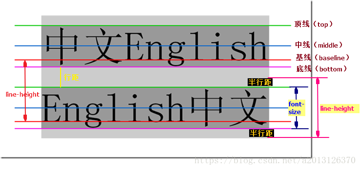

## 1行内对齐
+ 块级方向：指当前书写模式放置块级元素的方向。
+ 行内方向：指块级元素中行内元素的书写方向。
### 1.1缩进文本
+ text-indent
  + length|percentage，可以为负值。
  + 百分数相对于所在块级元素的宽度。
  + 只能作用到块级元素，会被继承。一行文本开头的图像也会随之后移。
### 1.2文本对齐
+ text-align
  + 控制各文本行的对齐方式，控制元素的内容。
  + 只能作用到块级元素，会被继承。
  + start|end|left|right|center
  + justify，两端对齐。由用户代理和部分属性决定。
  + match-parent，作用可被inherit，但过程不一致。inherit是原样继承，match-parent是计算得到，例如start计算为left。
  + start end 没有得到应用。
### 1.3对其最后一行
+ text-align-last
  + start|end|left|right|center|justify
  + 只能作用到块级元素，会被继承。
  + 如果一行后有强制换行，也会收到该属性值影响。
  + 如果只有一行的块级元素，该元素优先于text-align。
## 2.块级对齐
### 2.0补充
+ 基线：字母x的下边缘线。
  + 在文本之类内联元素中，基线是字符x的下边缘位置
  + 在像img元素中基线就是下边缘。
  + 在inline-block元素中，也分两种情况
    + 如果该元素中有内联元素，基线就是最后一行内联元素的基线。
    + 如果该元素内没有内联元素或者overflow不是visible，其基线就是margin的边缘。
+ ex：一个x的高度，不受字体和字号影响的内联元素的垂直居中对齐效果。
+ 对于非置换元素的纯内联元素，其可视高度完全由line-height决定
+ 内容区由字体的高度决定。
### 2.1行的高度
+ line-height
  + normal|number|length|percentage
  + em,ex,百分数针对元素的font-size值计算。
  + 指的是行的基线之间距离，控制行距，行距是除了字体高度之外在文本行上方的额外空间。
  + 默认值一般是1.2*font-size，它的值与字体高度之差就是行距。
  + 适用所有元素，可继承。
  + 对于块级元素来说，定义的是元素中文本行基线之间的最小距离。
  + 不影响置换元素的布局，但依然可以应用到置换元素上。
  + 
+ 行高的继承
  + 块级元素继承line-height时，根据父元素的字号计算。
  + 使用纯数字，继承的是换算系数，根据自身字号计算。
### 2.2纵向对齐文本
+ vertical-align
 + 其实vertical-align是用来设置行内元素对齐方式的。说白了就是display属性值为inline、inline-block、inline-table另加一个table-cell的元素
 + 针对行内元素和置换元素（单元格内容）,不继承。
 + baseline：强制元素的基线与父元素的基线对齐。没有基线的图像，表单输入框及其他置换元素，底端对齐。
 + sub：把元素放在下标处，由用户代理决定。
 + super：让元素基线高于父元素基线。
 + bottom：把元素所在行内框的底边与行框的底边对齐。
 + text-bottom：相对行中`文本的`底边对齐，元素行内框的底边与都元素的内容区的底边对齐。
 + top/text-top
 + middle:通常作用于图像上，把行内元素所在的方框的中线与父元素基线向上偏移0.5ex处的线对齐。
 + 百分数：把元素的基线相对父元素的基线抬升或下沉指定的量（百分数相对元素自身的line-height）
 + 长度值：把元素抬升或下沉的声明距离。
 + 行框包围最高那个行内框的顶端和最低那个行内框的底端。
## 3.单词间距和字符间距
+ word-spacing
  + 单词是指两侧具有某种空白的非空白字符构成的字符串
  + 不能用于象形字和非罗马书写体。
  + 可能受text-align影响。
  + 继承的值是计算得到的值，与父元素一样。
+ letter-spacing
  + 修改的是字符或字母之间的距离。
  + 如果是绝对值，不受text-align影响。
  + 继承的值是计算得到的值，与父元素一样。
## 4.文本转换
+ text-transform
  + 大小写。
  + uppercase|lowercase|capitalize|none
## 5.文本装饰
+ text-decoration
  + none|[underline||overling||line-through||blink]
  + blink可能不再被支持。
  + none的子元素可能仍旧有父元素的线，这是怪异的地方。
## 6.文本渲染效果
+ text-rendering
  + 让创作人员指定用户代理在显示文本时应该优先考虑什么方面。
  + optimizeSpeed（紧排和连字），首先考虑绘制速度，而不是清晰性特性。
  + optimizeLegibility 取决用户代理。
  + geometricPrecision
## 7.文本阴影
+ text-shadow
  + 一个可选颜色和三个长度值定义。
  + 第一个长度值定义横向偏移，第二个定义纵向偏移。
  + 第三个定义模糊半径。从阴影的轮廓到模糊边界的距离。
## 8.处理空白
+ white-space
  + 用户代理对源码中空格，换行符和制表符的处理方式。
  
+ tab-size
## 9.换行和断字
+ hypens
+ word-break
+ line-break
+ overflow-wrap(原word-wrap)
## 10.书写模式
+ writing-mode
  + horizontal-tb|vertical-lr|vertical-rl
+ text-orientation
  + 改编文本行中字符的方向。
下面两个属性可以使用Html的dir属性和《bdo》元素代替：
+ direcion
  + 影响块级元素中文本的书写方向。
+ unicode-bidi
  + 